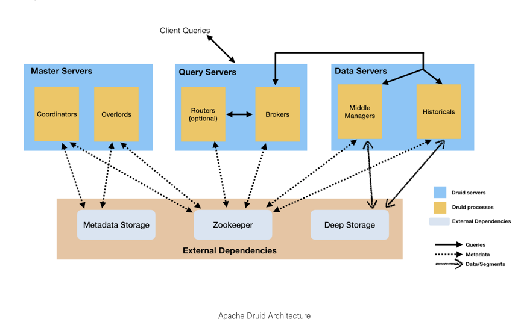
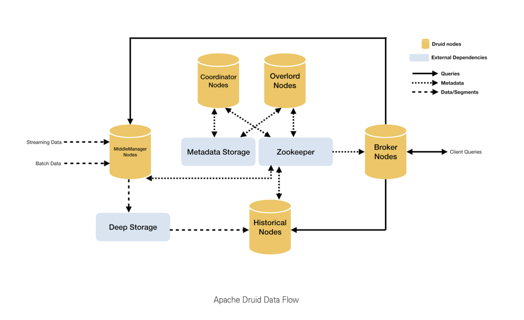
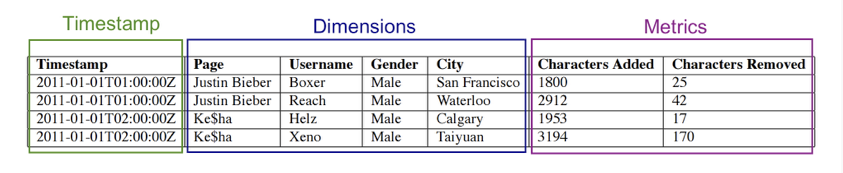
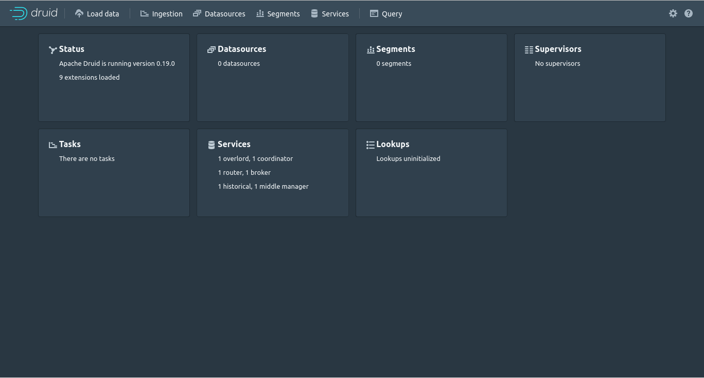

# Druid

## 목차

1. 개요
2. 구성
3. 설치 및 테스트
4. 사용법
5. 대모

------

## 개요

- Druid란?

  **드루이드**(Druid)는 [자바](https://ko.wikipedia.org/wiki/자바_(프로그래밍_언어))로 작성된 [컬럼 지향](https://ko.wikipedia.org/w/index.php?title=컬럼_지향_DBMS&action=edit&redlink=1) [오픈 소스](https://ko.wikipedia.org/wiki/오픈_소스_소프트웨어), [분산](https://ko.wikipedia.org/wiki/분산_데이터베이스) 데이터 스토어

- 개발언어

  JAVA

- 라이센스

  Apache Licencse 2.0

- 세그먼트의 권장 사이즈

  Druid가 무거운 쿼리 로드에서 잘 작동하려면 세그먼트 파일 크기가 권장 범위인 300MB-700MB 내에 있어야 한다.

- druid를 이용할 수 있는 [개발언어](https://druid.apache.org/libraries)

- pydruid

  Pydruid는 Druid 쿼리를 생성, 실행 및 분석할 수 있는 간단한 API를 제공한다.

  Pydruid는 후속 데이터 분석을 위해 Pandas DataFrame 객체에 쿼리 결과를 구문 분석할 수 있다.

  이는 Druid, SciPy stack(과학 컴퓨팅용) 및 Scikit-learn(기계 학습용) 간의 긴밀한 통합을 제공한다.

  pydruid는 R, Julia, Matlab, Excel과 같은 툴을 사용하여 추가 처리를 위해 질의 결과를 TSV 또는 JSON으로 내보낼 수 있다. 

  동기식 클라이언트와 비동기식 클라이언트를 모두 제공한다.

  pydruid는 Python DB API 2.0, SQLAlchemy dialect를 구현하며  Druid와 상호 작용하기 위한 command line 인터페이스를 제공한다.
  
- [참고자료](http://0ctopus13prime.blogspot.com/2016/12/druid-real-time-analytical-data-store.html)

------

## 구성

- Druid는 Coordinator, Overlord, Router, Broker, MiddleManager, Historical 로 프로세스가 구성되며, Master, Query, Data로 Server가 구성된다.




- Master Servers : 데이터 가용성과 수집 관리

  - Coordinator : 데이터 가용성 관리

    ​						Historical 노드를 감시하고 세그먼트가 Historica 노드에 균형을 잘 유지하도록 한다.

    ​					메타정보를 통해 segment life cycle(복제 계수 조정 및 Load/Drop)을 관리한다.

  - Overlord : 데이터 수집 워크로드 연결 제어

    ​				Ingestion Task를 MiddleManager에 할당하고 세그먼트 배포를 조정한다

    ​				task의 분산을 관리하며 local 또는 remote의 다수의 Middle Manager를 구성할 수 있다.

- Query Server : 외부 클라이언트에서 쿼리 처리

  - Router(Optional) : Broker, Overlord, Coordinator 앞에서 API Gateway 역할한다. 

    ​							각각의 노드 API에 직접 접근해도 된다. 

  - Broker : 외부 클라이언트에서 쿼리 요청을 받고 이 쿼리를 Historical와 MiddleManager에 전달한다. 

    ​			User는 Historical, MiddleManager에 직접 쿼리하기 보단 Broker에 쿼리하는게 좋다.

    ​			외부 클라이언트로부터의 쿼리 처리

- Dataserver : 수집 워크로드를 실행하여 쿼리 가능한 모든 데이터 저장

  - Middle Manager : 새로운 데이터를 외부 데이터 소스로 부터 받아 클러스터에 배포한다.
  - Historical : 딥 스토리지로 부터 세그먼트를 다운 받아 처리하고 이 세그먼트에 대한 쿼리에 응답한다.

- Extanal Dependencies

  - Metadata Storage : 세그먼트 가용성 정보나 테스크 정보(PostgreSQL 또는 MYSQL) 등 다양한 공유 시스템 메타 데이터를 보관유지 

    ​								세그먼트 가용성 정보 및 작업 정보와 같은 다양한 시스템 메타 데이터를 보유한다.

  - Zookeeper : 내부 컴포넌트간 통신은  zookeeper를 통해 사용된다

    ​					현재 클러스터 상태를 관리하기 위해 주키퍼를 사용한다. 

  - Deep Storage : 모든 Druid 서버에서 액세스 가능한 공유 파일 스토리지

    ​						세그먼트를 영구적으로 저장하기 위한 영역 

    ------

## 데이터 Flow



Data 서버의 MiddleManager와 Historical로 신규 유입 데이터 및 파티션 별 데이터가 저장되면, Query 서버의 Broker로 Client Query를 요청 받고 해당 데이터를 사용자에게 전달한다.

1. 유입되는 데이터는 MiddleManager로 계속해서 색인되고 시간 기준으로 파티셔닝된 Segment는 Deep Storage로 전송된다.
2. 이후에는 Historical이 저장된 Segment 파일을 Deep Storage로부터 local cache로 다운 받음으로써 Query 요청이 탐색 가능한 상태가 된다.
3. 이 때, 유입되는 데이터 즉, Ingestion과 Segment 관리는 Coordinator와 Overlord에 의해 수행된다.
4. Coordinator는 Historical 서버들에 생성 완료된 Segment들을 로드 밸런싱을 통해 배치하거나 제외시키며, Overlord는 MiddleManager로 유입되는 데이터와 Segment를 관리한다.

- MiddleManager는 태스크 당 하나의 Peon을 구동시켜 유입 데이터를 처리하며, Peon은 MiddleManager와 같은 호스트 내 별도 JVM에서 구동된다.

  - peon : 단일 jvm에서 수행되는 하나의 태스크를 말하며 Middle Manager에 의해 생성

- Router는 선택적으로 수행 가능한 프로세스로 Broker/Coordinator/Overlord에 대한 통합 API를 제공한다.

  ------

## Segment



segment는 columnar로 구성되며 컬럼 타입은 위와 같다.

**Timestamp** : 오직 하나의 타임스탬프 필드를 가질 수 있다.

> time series 기반이기에 **timestamp**가 중요하다. 

**Dimensions** : String type(delimiter로 여러 개를 가질 수 있다), filter/group by가 가능하다.

> **Dimensions**은 filter/group by가능한 필드이며 현재는 String type (delimiter를 주어 multi value도 가능) 만 지원하고 있다.

**metrics** : 수치 데이터 및 집계 연산 담당

> **metrics**는 수치데이터 이며 timestamp 기준에 따라 pre-aggregation/post-aggregation이 가능하다. 

### 따라서 Druid는 time series 기반이기 때문에 실시간/배치로 데이터를 수집하여 OLAP(Online Analytical Processing) 질의를 처리할 수 있다.

------

## Requirements

- Linux, Mac OS X, or other Unix-like OS (Windows is not supported)
- Java 8, Update 92 or later (8u92+)
- 주의 사항
> 드루이드는 공식적으로 자바 8만 지원한다. Java 8 이후 버전에 대한 지원은 현재 실험 상태에 있다.
>
> Druid relies on the environment variables `JAVA_HOME` or `DRUID_JAVA_HOME` to find Java on the machine. You can set `DRUID_JAVA_HOME` if there is more than one instance of Java. To verify Java requirements for your environment, run the `bin/verify-java` script.
>
>  In general, avoid running Druid as root user. Consider creating a dedicated user account for running Druid.

------

## Druid 설치

- linux
  - $ wget http://apache.mirror.cdnetworks.com/druid/0.19.0/apache-druid-0.19.0-bin.tar.gz
  - $ tar -xzf apache-druid-0.19.0-bin.tar.gz cd apache-druid-0.19.0
  - $ cd apache-druid-0.19.0

[구축 guide](https://druid.apache.org/docs/latest/operations/single-server.html)에 나오는 권장 사향에 맞춰서 ./bin/start-...로 실행 해준다 

```
./bin/start-micro-quickstart
```

- Docker

  [docker-compose.yml](https://github.com/apache/druid/blob/master/distribution/docker/docker-compose.yml)

  [environment](https://github.com/apache/druid/blob/master/distribution/docker/environment)

  - $ docker pull apache/druid:0.19.0
  - $ docker-compose up

http://localhost:8888에서 Druid의 콘솔을 확인할 수 있다.



------

## pydruid

[pydruid_docs](https://pythonhosted.org/pydruid/)

## 설치

- from pip

```bash
$ pip install pydruid
# or, if you intend to use asynchronous client
$ pip install pydruid[async]
# or, if you intend to export query results into pandas
$ pip install pydruid[pandas]
# or, if you intend to do both
$ pip install pydruid[async, pandas]
# or, if you want to use the SQLAlchemy engine
$ pip install pydruid[sqlalchemy]
# or, if you want to use the CLI
$ pip install pydruid[cli]
```

- from source

```bash
$ git clone https://github.com/druid-io/pydruid.git
$ cd pydruid
$ python setup.py install
```

## 접속

```python
from pydruid.client import *
query = PyDruid(druid_url_goes_here, 'druid/v2')
```

## 함수

### timeseries

```python
ts = query.timeseries(
    datasource='twitterstream',
    granularity='day',
    intervals='2014-02-02/p4w',
    aggregations={'length': doublesum('tweet_length'), 'count': doublesum('count')},
    post_aggregations={'avg_tweet_length': (Field('length') / Field('count'))},
    filter=Dimension('first_hashtag') == 'sochi2014'
)
```

### topN

```python
top = query.topn(
    datasource='twitterstream',
    granularity='all',
    intervals='2014-03-03/p1d',  # utc time of 2014 oscars
    aggregations={'count': doublesum('count')},
    dimension='user_mention_name',
    filter=(Dimension('user_lang') == 'en') & (Dimension('first_hashtag') == 'oscars') &
           (Dimension('user_time_zone') == 'Pacific Time (US & Canada)') &
           ~(Dimension('user_mention_name') == 'No Mention'),
    metric='count',
    threshold=10
)
```

### groupby

```python
group = query.groupby(
    datasource='twitterstream',
    granularity='hour',
    intervals='2013-10-04/pt12h',
    dimensions=["user_name", "reply_to_name"],
    filter=(~(Dimension("reply_to_name") == "Not A Reply")) &
           (Dimension("user_location") == "California"),
    aggregations={"count": doublesum("count")}
)
```

## DB API

```python
from pydruid.db import connect

conn = connect(host='localhost', port=8082, path='/druid/v2/sql/', scheme='http')
curs = conn.cursor()
curs.execute("""
    SELECT place,
           CAST(REGEXP_EXTRACT(place, '(.*),', 1) AS FLOAT) AS lat,
           CAST(REGEXP_EXTRACT(place, ',(.*)', 1) AS FLOAT) AS lon
      FROM places
     LIMIT 10
""")
for row in curs:
    print(row)
```

## SQL Alchemy

```python
from sqlalchemy import *
from sqlalchemy.engine import create_engine
from sqlalchemy.schema import *

engine = create_engine('druid://localhost:8082/druid/v2/sql/')  # uses HTTP by default :(
# engine = create_engine('druid+http://localhost:8082/druid/v2/sql/')
# engine = create_engine('druid+https://localhost:8082/druid/v2/sql/')

places = Table('places', MetaData(bind=engine), autoload=True)
print(select([func.count('*')], from_obj=places).scalar())
```

### Column headers

```python
engine = create_engine('druid://localhost:8082/druid/v2/sql?header=true')
```

## Command line

```bash
$ pydruid http://localhost:8082/druid/v2/sql/
> SELECT COUNT(*) AS cnt FROM places
  cnt
-----
12345
> SELECT TABLE_NAME FROM INFORMATION_SCHEMA.TABLES;
TABLE_NAME
----------
test_table
COLUMNS
SCHEMATA
TABLES
> BYE;
GoodBye!
```

------

## Input data format

- JSON

```json
"ioConfig": {
  "inputFormat": {
    "type": "json"
  },
  ...
}


```

The JSON `inputFormat` has the following components:

| Field       | Type        | Description                                                  | Required |
| ----------- | ----------- | ------------------------------------------------------------ | -------- |
| type        | String      | This should say `json`.                                      | yes      |
| flattenSpec | JSON Object | Specifies flattening configuration for nested JSON data. See [`flattenSpec`](https://druid.apache.org/docs/latest/ingestion/data-formats.html#flattenspec) for more info. | no       |
| featureSpec | JSON Object | [JSON parser features](https://github.com/FasterXML/jackson-core/wiki/JsonParser-Features) supported by Jackson library. Those features will be applied when parsing the input JSON data. | no       |

### 

- CSV

```json
"ioConfig": {
  "inputFormat": {
    "type": "csv",
    "columns" : ["timestamp","page","language","user","unpatrolled","newPage","robot","anonymous","namespace","continent","country","region","city","added","deleted","delta"]
  },
  ...
}
```

The CSV `inputFormat` has the following components:

| Field                 | Type       | Description                                                  | Required                                                 |
| --------------------- | ---------- | ------------------------------------------------------------ | -------------------------------------------------------- |
| type                  | String     | This should say `csv`.                                       | yes                                                      |
| listDelimiter         | String     | A custom delimiter for multi-value dimensions.               | no (default = ctrl+A)                                    |
| columns               | JSON array | Specifies the columns of the data. The columns should be in the same order with the columns of your data. | yes if `findColumnsFromHeader`is false or missing        |
| findColumnsFromHeader | Boolean    | If this is set, the task will find the column names from the header row. Note that `skipHeaderRows`will be applied before finding column names from the header. For example, if you set `skipHeaderRows` to 2 and `findColumnsFromHeader` to true, the task will skip the first two lines and then extract column information from the third line. `columns` will be ignored if this is set to true. | no (default = false if `columns` is set; otherwise null) |
| skipHeaderRows        | Integer    | If this is set, the task will skip the first `skipHeaderRows` rows. | no (default = 0)                                         |

### 


